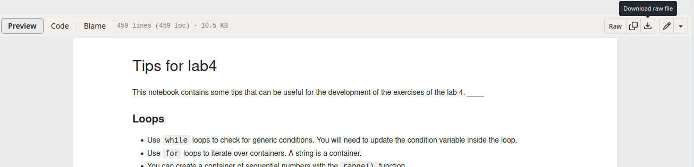

# Tips for Computer Science labs.

Jupyter notebooks with some tips for the development of labs for the course of computer science at Politecnico di Torino.

If you find any issues with it please let me know so I can fix them.


## Downloading

 - You can open and download each individual `ipynb` file. The download button is in the top right:
  
 - You can also **clone** the full repository to your pc with **git**. Google how to do it, but basically after installing git in your pc, you just need to run from the git terminal:
  ```
  git clone https://github.com/waltergallegog/cs-polito-lab-tips.git
  ```

## Running
There are multiple ways of running the notebooks.

### With VsCode
Given that in the course we are using VsCode, you can use it to run the notebooks. You may need to install the `ipykernel` package in your computer order to be able to run them. The installation should be something like this from a terminal:

```
python3 -m pip install ipykernel -U --user --force-reinstall
```


### With Google Colab.
Google Colab allows you to run the notebooks online. Just open a notbook in the web browser and in the url change **github**  with **githubtocolab** and hit enter. This will take you to colab.

For example, for lab4:
 - normal url with github, will open the notebook:
https://github.com/waltergallegog/cs-polito-lab-tips/blob/main/lab4.ipynb

 - modified url, will take you to colab where you can run it:
https://githubtocolab.com/waltergallegog/cs-polito-lab-tips/blob/main/lab4.ipynb
